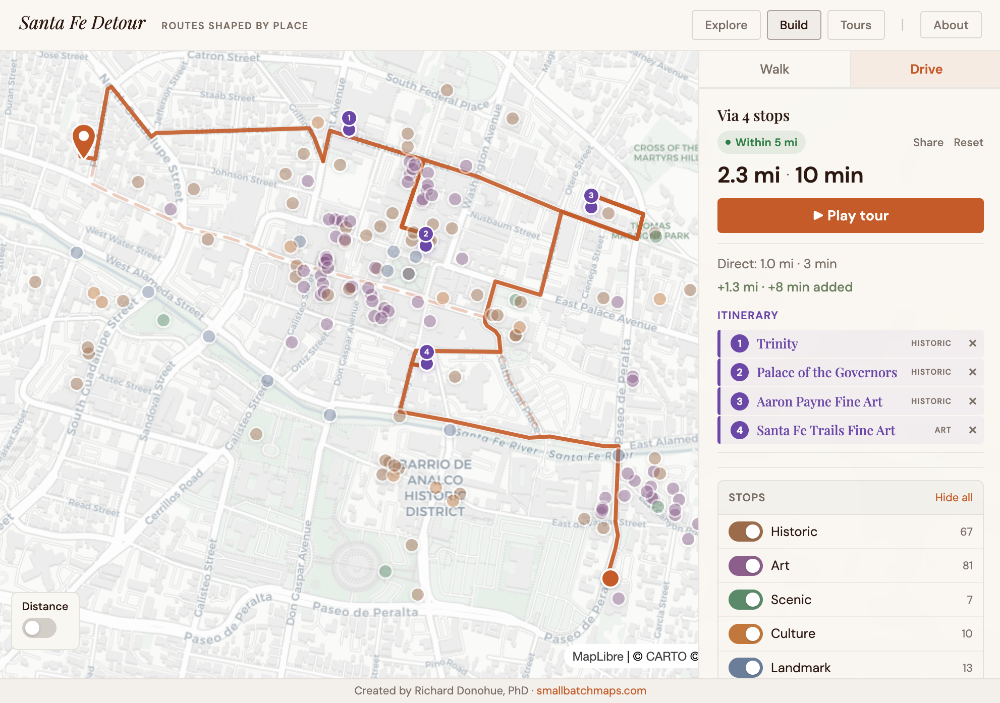

# Detour

**routes shaped by place — a routing experiment built first in Santa Fe.**



Detour is a Santa Fe-first routing prototype for building place-aware routes: start with the shortest walking or driving path, surface curated nearby stops, and show the distance/time cost of making the route more interesting. It is built as a small full-stack product slice, with real routing calls, shareable state, curated POI data, and a tour-viewing surface.

## Why this exists

Detour is now aimed first at people who create visitor experiences: professional tour guides, hotel concierges, and tourism bureaus. Visitors are the downstream users who receive, preview, or follow the routes those professionals shape.

Shortest route, or route worth taking?

## What the app does

### Build

`/build` is the route-building surface. Click once for an origin and again for a destination; the app requests the OpenRouteService shortest route, supports drive/walk mode, shows network-distance rings, suggests curated route-adjacent stops, and reroutes through selected waypoints.

Selected stops can be added from the list or map, and their visit order is automatically optimized before the multi-stop route is requested. Origin, destination, mode, category filters, and via-stop coordinates are kept in the URL so a route can be refreshed or shared.

### Explore

`/` currently renders the Explore surface. It shows the curated Santa Fe place layer before a route has been built, using the same local POI data that powers current Build-mode suggestions.

### Tour

`/tours` lists pre-built gallery tours, `/tours/:slug` renders a scrollytelling tour map, and `/tours/preview` plays a Build-mode route preview stored in `sessionStorage`. This is the exploratory surface for turning a planned route into something a visitor can consume.

## Notable engineering decisions

- **Stop ordering as a small TSP:** `optimizeStopOrder` builds a haversine distance matrix and brute-forces the optimal order for up to 9 selected stops, then falls back to nearest-neighbor above that threshold.
- **Single-call multi-range isochrones:** the backend requests all service-area rings from ORS in one `/v2/isochrones/{profile}` call.
- **URL as shareable state:** Build-mode map state is encoded in query params rather than hidden in client memory.
- **Scrollytelling without a framework:** the Tour surface is a custom React/MapLibre page, keeping the interaction model close to the product needs.
- **Mock-mode dev fallback:** missing `ORS_API_KEY` returns predictable mock route and isochrone shapes so the app can still be developed locally.
- **Server-side cache for area rings:** `/api/area` responses use TTL caching, with disk persistence for area GeoJSON, to reduce repeated isochrone calls.
- **Polygon tooling kept separate:** route-based polygon cache helpers exist, but they are not wired into the normal interactive `/api/area` flow.

## Architecture at a glance

```text
Browser --> Vite dev proxy --> FastAPI --+--> OpenRouteService directions + isochrones
                                         +--> Curated POI/tour data
                                         +--> TTL cache for area rings
```

```text
apps/
  web/   React + TypeScript + Vite + MapLibre
  api/   FastAPI backend, ORS client, curated POI/tour loaders
docs/    deployment notes, UX direction, technical notes, seed data
cache/   persisted area-ring GeoJSON when generated locally
```

## Tech stack

- **Frontend:** React, TypeScript, Vite, MapLibre GL JS.
- **Backend:** FastAPI, Python 3.11, with pytest-based API utility tests.
- **Routing:** ORS directions endpoint `/v2/directions/{profile}/geojson`, using `preference="shortest"` for `driving-car` and `foot-walking`.
- **Isochrones:** ORS endpoint `/v2/isochrones/{profile}`, requesting multiple distance ranges in one call.
- **POIs:** an ORS `/pois` wrapper exists, but live ORS POI selection is currently disabled; current Explore and Build POIs come from curated/static Santa Fe data.
- **Basemaps:** CARTO raster tiles in Build and Explore; OpenFreeMap Positron in `TourStoryMap`.

## Repo tour

- [apps/web/src/components/Map.tsx](apps/web/src/components/Map.tsx) - Build-mode map, click-to-route flow, stop selection, URL state, and preview launch.
- [apps/web/src/pages/TourStoryMap.tsx](apps/web/src/pages/TourStoryMap.tsx) - scrollytelling tour viewer.
- [apps/web/src/lib/optimizeStops.ts](apps/web/src/lib/optimizeStops.ts) - selected-stop order optimization.
- [apps/api/main.py](apps/api/main.py) - FastAPI routes for config, area rings, routes, stop suggestions, POIs, and tours.
- [apps/api/ors_client.py](apps/api/ors_client.py) - ORS directions and isochrone client with mock fallback behavior.
- [docs/UX_DIRECTION.md](docs/UX_DIRECTION.md) - product direction, personas, and roadmap options.

## Running locally

### Prerequisites

- **Node.js 18+**
- **Python 3.11+**
- **OpenRouteService API key**  
  Sign up at: [https://openrouteservice.org/dev/#/signup](https://openrouteservice.org/dev/#/signup)

### Environment

```bash
cp .env.example .env
# Edit .env and add ORS_API_KEY
```

The `.env` origin values define the default map center and backend fallback origin. In the UI, the user can choose any origin by clicking the map.

### Frontend

```bash
cd apps/web
npm install
npm run dev
```

Runs at: `http://localhost:5173`

### Backend

```bash
cd apps/api
python -m venv .venv
source .venv/bin/activate
pip install -r requirements.txt
uvicorn main:app --reload
```

Runs at: `http://localhost:8000`

In local development, Vite proxies `/api` requests to the backend.

## Shareable URL state

The Build surface keeps key route state in the URL so a route can be refreshed or shared directly.

Current shared state includes:

- origin
- destination
- stop category filters
- selected stop coordinates via `via`
- travel mode

Example:

```text
?origin=-105.9394,35.687&destination=-105.944,35.683&category=art&via=-105.941,35.685&mode=walk
```

## Deployment

The project is deployed as two Railway services from the same monorepo.

```text
apps/web   -> frontend
apps/api   -> backend
```

See [docs/DEPLOY.md](docs/DEPLOY.md) for deployment details.

## Current limitations

- No text search or geocoder for route endpoints.
- No auth, accounts, saved tours, or durable user-owned route persistence.
- Current POI surfaces use curated/static Santa Fe data rather than external search APIs.
- The product and dataset are seeded for Santa Fe first.
- Without a valid OpenRouteService API key, the backend returns mock responses for development.

## Project direction

The current product direction targets professional visitor-experience planning for Santa Fe tour guides, hotel concierges, and tourism bureaus.

See [docs/UX_DIRECTION.md](docs/UX_DIRECTION.md) for personas, feature brainstorm, and roadmap options.

## Status

Active Santa Fe-first prototype. Build and Explore are functional map surfaces, Tour is an exploratory scrollytelling surface, and the next obvious product gaps are search, auth, and persistence rather than core routing.
